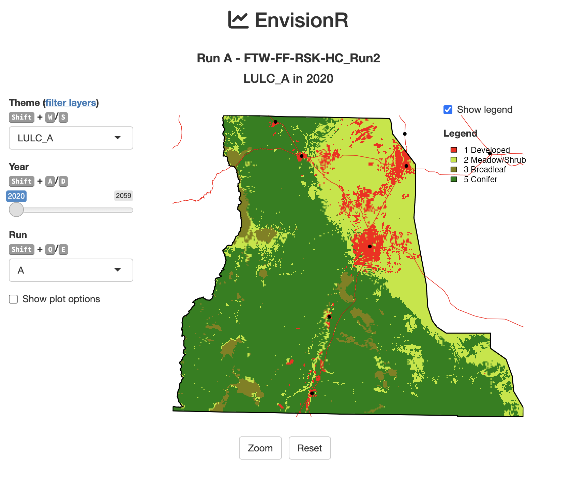

EnvisionR
================
Cody Evers
2024-03-20

EnvisionR is a R Shiny application for exploring Envision runs using a
simple mapping interface. It includes additional functionality for
assembling data into ‘high dimensional’ datacubes for post-hoc analyses
of Envision runs. This README contains information for installing and
running EnvisionR.

<figure>

<figcaption aria-hidden="true">EnvisionR shiny interface</figcaption>
</figure>

## Setting up EnvisionR

EnvisionR uses R Shiny to interact and map data. That means it requires
installing both R and RStudio on your system, then creating a new R
Studio project where you can run EnvisionR, save your datacubes, and
keep R scripts.

## Create R project

1.  Create a folder on computer in a easy to find location (e.g.,
    documents)
2.  Open RStudio: Launch RStudio on your computer.
3.  Go to the File menu at the top left corner of RStudio, then select
    New Project
4.  Select Existing Directory and navigate to the folder you want to
    use.

This will create a new RStudio project with an .Rproj file in the
specified directory. This file helps manage paths and settings specific
to your project. A key benefit of using R projects is that it
automatically sets the working directory to the location of the Rproj
files. The working directory is useful because you can point to files in
the working directory without needing to specify the absolute location
(e.g., C:/ or /users/username/).

## Install required packages

EnvisionR requires several external packages: pacman, devtools, dplyr,
tidyr, purrr, sf, stars, terra, data.table, xml2, shiny, shinyjs, and
shinyWidgets. Type the following line into the R console to first
install the package pacman, then use pacman to download devtools.

``` r
if (!require("pacman")) install.packages("pacman")
pacman::p_load(devtools) 
```

## Install EnvisionR

Download and install the EnvisionR package using the `install_github()`
from the devtools package to install the EnvisionR package from github.
You only need to install the package once.

``` r
devtools::install_github('https://github.com/codyevers/envisionr', build = FALSE, force = TRUE)
```

## Required pacakges

The devtools should automatically install and load all external packages
needed for EnvisionR. For reference, these are: dplyr, dtplyr, tidyr,
purrr, stringr, glue, stars, terra, sf, data.table, xml2, shiny,
shinyWidgets, shinyjs. If you run into problems with dependencies when
running EnvisionR, use pacman::p_load() to install and load these
packages.

``` r
pacman::p_load(dplyr, dtplyr, tidyr, purrr, glue) 
pacman::p_load(stars, terra, sf, data.table, xml2)
pacman::p_load(shiny, shinyWidgets
```

## Load EnvisionR package

Once installed, we load EnvisionR using `library(envisionr)`, which
makes the functions and data contained in the package available to call
from your script. Unlike installing packages, which you only need to do
once, you’ll need to load the package every time you start a new R
session.

``` r
library(envisionr)
```

## Download datacubes

Load some of the datacubes that we’d like to explore. These are large
files (~250MB each) so are not included in the EnvisionR package itself.
Rather, you’ll want to create a folder in your project folder called
`datacubes` then download the following files from box and then move
them to the datacubes directory. Download the datacubes files you need
from the CNH2 FireNet box folder:
<https://oregonstate.box.com/s/jubxxvv4gcyihuss6azx86e612bt65ux>).

## Load datacubes into memory

Read datacubes saved in your `datacubes` directory into memory using
`load_datacube` and assign each to its own object (e.g., dc1, dc2, etc).

``` r
dc1 <- load_datacube('datacubes/FTW-FF-RSK-HC_Run2.datacube')
dc2 <- load_datacube('datacubes/FTW-FF-RSK-HD_Run2.datacube')
dc3 <- load_datacube('datacubes/FTW-FF-RSK-LD_Run2.datacube')
dc4 <- load_datacube('datacubes/FTW-FF-SC-HC_Run2.datacube')
```

## Run EnvisionR

Run EnvisionR using `run_envisionr` by providing the datacubes we just
read into memory.

``` r
run_envisionr(dc1, dc2, dc3, dc4)
```

## Building new datacubes

## Building new datacubes

Build datacubes from scratch. You’ve run Envision and taken the delta
array csv file, placed it in a directory called `deltaarrays` in your
working directory and renamed it to `DeltaArra_example.csv`. Read the
csv into memory then convert the csv into a datacube called `dc` for 4
selected fields. Save the datacube to your `datacubes` directory for
later use.

``` r
# read delta_array csv into memory (1 minute)
da <- read_delta_csv('/deltaarrays/DeltaArray_example.csv')

# list attributes contained within the delta array
unique(da$field)

# select fields to include in the datacube
fields = c('LULC_B','VEGCLASS','DISTURB','VARIANT','N_DU','SIZE','CANOPY','LAYERS')

# build datacube (1 minute) - save as stars object
dc <- build_datacube(
  delta_array = da,
  fields = fields,
  run_name = 'test_run')

# save datacube object to the datacubes folder
save_datacube(dc, filename = 'datacubes/dc_test.datacube')

# load the datacube (same as above)
dc1 <- load_datacube('datacubes/dc_test.datacube')

# show datacube info
print(dc1)

# run EnvisionR 
run_envisionr(dc1)
```

## Required data

This script requires several reference files which are saved in the
`data/misc` folder .

- `datacubes/*.datacube` R binary data files containing datacube saved
  as a stars object.
- `data/idu.xml` Taken directly from Envision; used to assign colors to
  different values.
- `data/ref_data.rda` Required reference spatial data including IDU,
  roads, zones, etc.

## Functions

Functions are organized in a series of R scripts. These are built into
package itself. But

- `R/ui` Shiny UI function
- `R/server.R` Shiny server function
- `R/run_func.R` run_envisionr wrapper function (main interface w/
  EnvisionR)
- `R/datacube_func.R` Functions related to building datacubes
- `R/download_func.R` Functions for downloading delta arrays
- `R/load_func.R` Functions for loading data
- `R/plot_func.R` Functions for plotting datacubes
